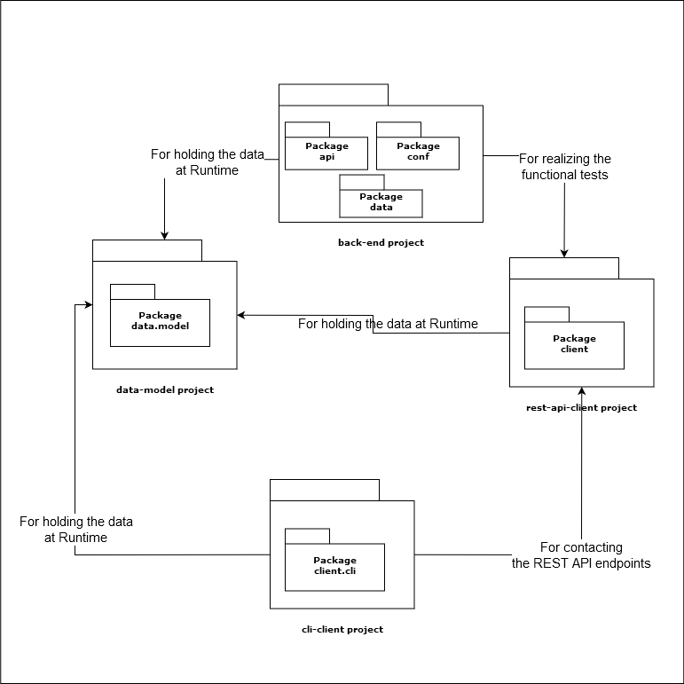

# softeng2019b Example Project Repository

Σχολή Ηλεκτρολόγων Μηχανικών & Μηχανικών Η/Υ, ΕΜΠ

Παράδειγμα για την εργασία στο μάθημα [Τεχνολογία Λογισμικού](http://courses.softlab.ntua.gr/softeng/2019b/), Χειμερινό εξάμηνο 2019 (softeng19b).

## Δομή φακέλων

Η υποχρεωτική κοινή δομή των φακέλων του repository (που θα πρέπει να ακολουθηθεί και στη δική σας εργασία, ανεξάρτητα του αν θα χρησιμοποιήσετε τις τεχνολογίες του παραδείγματος ή όχι) περιγράφεται στο έγγραφο των παραδοτέων (βλ. moodle μαθήματος). 

Η δομή των φακέλων στο συγκεκριμένο παράδειγμα είναι η εξής:

* Στον φάκελο `back-end` περιέχεται ο κώδικας του back-end.
* Στον φάκελο `cli-client` περιέχεται ο κώδικας του command line application.
* Στον φάκελο `data-model` περιέχεται ο κοινός κώδικας που ορίζει το data-model της εφαρμογής (π.χ. η κλάση [ATLRecordForSpecificDay](data-model/src/main/java/gr/ntua/ece/softeng19b/data/model/ATLRecordForSpecificDay.java), χρησιμοποιείται σε όλα σημεία του κώδικα που πρέπει να γίνει διαχείριση τέτοιων ActualTotalLoad records). To `data-model`, δηλαδή, είναι ένα ξεχωριστό software project, το οποίο περιέχει μια βιβλιοθήκη κώδικα (software library). Η βιβλιοθήκη αυτή (επανα)χρησιμοποιείται απ' όλα τα άλλα software projects του repository.
* Στον φάκελο `rest-api-client` περιέχεται ο κοινός κώδικας που ενθυλακώνει τις client λειτουργίες του Rest API. Και εδώ έχουμε περίπτωση βιβλιοθήκης, η οποία επαναχρησιμοποιείται από το `cli-client` (για να εκτελεί την επικοινωνία με το `back-end`) και από το ίδιο το `back-end`, ως test dependency για την υλοποίηση των functional tests.
* Στον φάκελο `front-end` περιέχεται ο κώδικας της front-end web εφαρμογής.

## Διάγραμμα πακέτων (package diagram)

Στο διάγραμμα δεν εμφανίζεται το front-end app, καθώς δε μοιράζεται πακέτα με κάποιο από τα υπόλοιπα projects.



## Κύριες τεχνολογίες του παραδείγματος

* [Java 11](https://docs.oracle.com/en/java/javase/11/)
* [Gradle build tool](https://gradle.org/)
* [Spock testing framework](http://spockframework.org/)

### Back-end

* [Restlet framework](https://restlet.talend.com/documentation/tutorials/2.4/overview)
* [MySQL Connector/J](https://dev.mysql.com/doc/connector-j/8.0/en/)
* [Spring JDBC](https://spring.io/guides/gs/relational-data-access/)

### CLI client

* [Picocli](https://picocli.info)

### Rest api client

* [Wire mock server](http://wiremock.org/)

### Front-end
* [React](https://reactjs.org/)
* [CRA (Create-React-App)](https://create-react-app.dev/)

## Γρήγορες οδηγίες

* Εγκατάσταση του Open JDK 11 από [εδώ](https://adoptopenjdk.net/). Για τους linux/macos χρήστες, προτείνετε η χρήση του [sdkman](https://sdkman.io/) για την εγκατάστασή του. Δεν απαιτείται η "χειροκίνητη" εγκατάσταση άλλου λογισμικού (π.χ. Gradle).

* Για την εκτέλεση του back-end:

```bash
cd back-end
./gradlew apprun
```

Το REST API base URL είναι το `https://localhost:8765/energy/api`, όπως απαιτείται από την εργασία. 

* Για την εκτέλεση του cli app:

```bash
cd cli-client
./gradlew installDist
./build/install/energy_TEAM/bin/energy_TEAM -h
./build/install/energy_TEAM/bin/energy_TEAM ActualTotalLoad -h
```

Κατά την ανάπτυξη του cli app, μπορείτε να χρησιμοποιείτε:

```bash
./gradlew run -Pargs="ActualTotalLoad -h"
```

Χρησιμοποιήστε τον editor / IDE της προτίμησής σας για να επεκτείνετε τον κώδικα του παραδείγματος (αν και όπως επιθυμείτε). 

Περισσότερα στο σχετικό φροντιστήριο...
